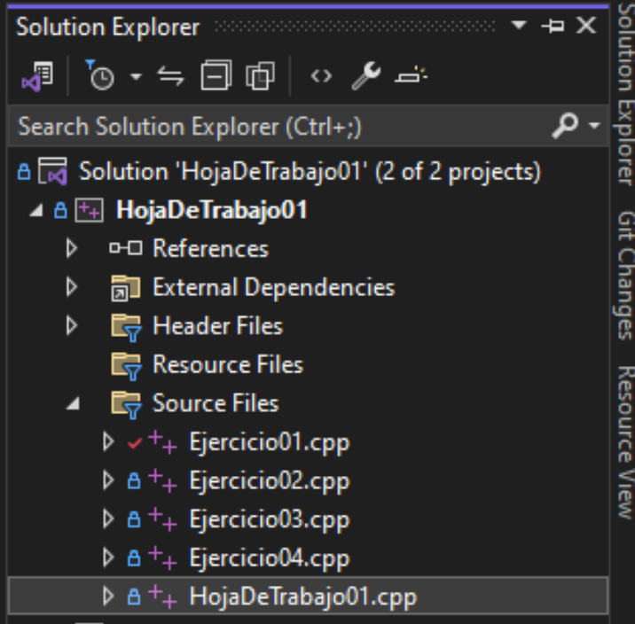
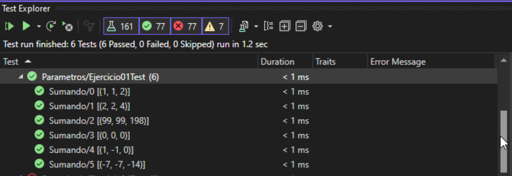
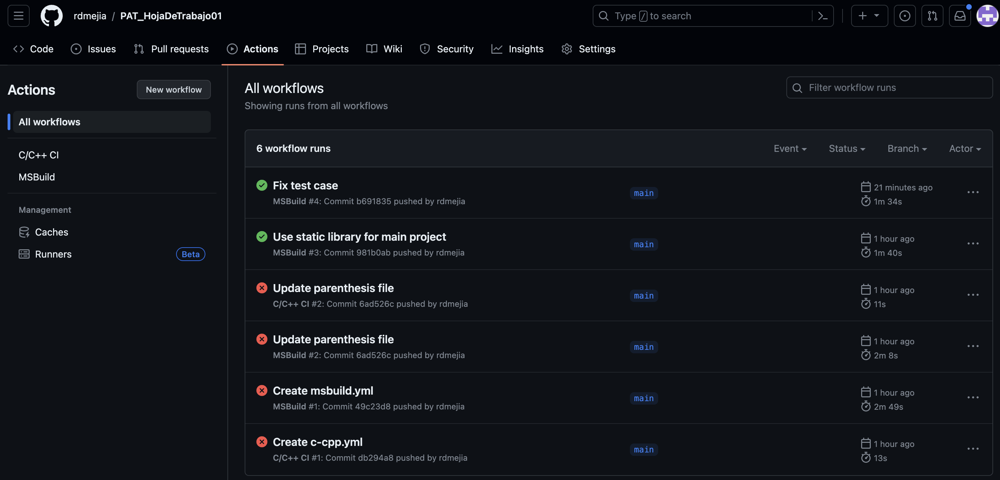

# Hoja de Trabajo 01

## Clonando el código

1. Para iniciar el laboratorio, debe crear un *Fork* del repositorio:


2. Clone el nuevo repositorio en su computadora y ábralo en Visual Studio.

3. Abra el archivo **HojaDeTrabajo01.cpp** que se encuentra en el folder de **HojaDeTrabajo01** y modifíquelo para que imprima su nombre y carnet:



## Ejercicio 1

1. En el menú de Visual Studio, en la sección de Tests, seleccione *Run All Tests*


2. La mayoría de las pruebas deberían fallar.


3. Abra los archivos **Ejercicio01.h** y **Ejercicio01.cpp** que se encuentra en el folder **HojaDeTrabajo01**

4. Cambie el valor de retorno de la función **sum** para que retorne el valor de la suma entre las variables: **a** y **b**

5. Al hacer los cambios necesarios, ejecute todas las pruebas nuevamente



6. Agregue los cambios, haga commit y luego `git push` a su repositorio en GitHub

7. Si siguió los pasos correctamente, en su repositorio de GitHub, podrá ver los resultados de la ejecucion de sus pruebas remotamente



## Ejercicio 02

Dada una palaba `s`, cree una función *recursiva* para determinar si dicha palabra es palíndroma o no.

Una palabra se considera palíndroma si se lee de la misma manera al derecho y al revés.

Todos los caracteres de `s` son letras minúsculas y también son parte del alfabeto internacional.

### Ejemplo 2.1

    s = "a"
    resultado = true
___

### Ejemplo 2.2

    s = ""
    resultado = true
___

### Ejemplo 2.3

    s = "ab"
    resultado = false
___

### Ejemplo 2.4

    s = "reconocer"
    resultado = true
___

## Ejercicio 03

Dano un entero `n`, retorne `true` si `n` es una potencia de dos. De lo contrario, retorne `false`.

Implemente une función *recursiva*.

### Ejemplo 3.1

    n = 1
    resultado = true

Explicación: 2<sup>0</sup>=1
___

### Ejemplo 3.2

    n = -16
    resultado = true

Explicación: 2<sup>-4</sup>=-16
___

### Ejemplo 3.3

    n = 9
    resultado = false
___

## Ejercicio 04

Dado `n` pares de parentésis, implemente una función que retorne **todas** las posibles combinaciones de parentésis *correctamente formados*.

### Ejemplo 4.1

    n = 3
    resultado = ["((()))","(()())","(())()","()(())","()()()"]
___

### Ejemplo 4.2

    n = 1
    resultado = ["()"]
___

#### Restricciones

```1 <= n <= 8```
